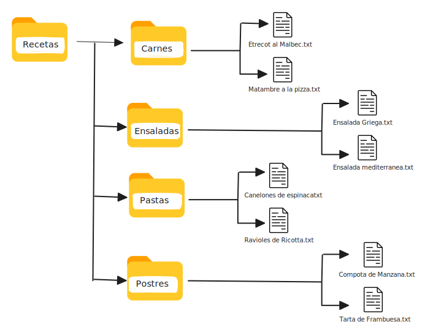

El programa dará primero la bienvenida al usuario, le va a informar
la ruta de acceso al directorio donde se encuentra nuestra carpeta de recetas, le va a informar
cuántas recetas hay en total dentro de esa carpeta, y luego le va a pedir que elija una de
estas opciones que tenemos aquí:
1. La opción 1 le va a preguntar qué categoría elige (carnes, ensaladas, etc.), y una vez que
el usuario elija una, le va a preguntar qué receta quiere leer, y mostrar su contenido.
2. En la opción 2 también se le va a hacer elegir una categoría, pero luego le va a pedir que
escriba el nombre y el contenido de la nueva receta que quiere crear, y el programa va
a crear ese archivo en el lugar correcto.
3. La opción 3 le va a preguntar el nombre de la categoría que quiere crear y va a generar
una carpeta nueva con ese nombre.
4. La opción 4, hará todo lo mismo que la opción uno, pero en vez de leer la receta, la va
a eliminar
5. La opción 5, le va a preguntar qué categoría quiere eliminar
6. Finalmente, la opción 6 simplemente va a finalizar la ejecución del código. 

## Estructura de carpetas:
